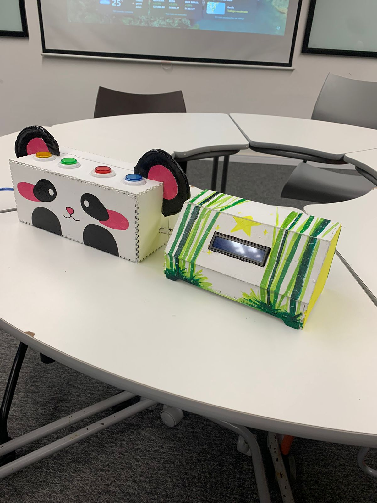

#  🎍 Bambubot

 O BAMBUBOT é um sistema digital feito em Arduino a partir de um projeto com integrantes de Ciência da Computação e Design. Esse artefato se assemelha a um “panda”, que contém botões interativos responsáveis por auxiliar o desenvolvimento das habilidades de comunicação de crianças com TEA.

## 🚀 Tecnologias Utilizadaas

- Linguagens: C++, Python
- Bibliotecas: Pyserial, Pygame, LiquidCrystal_I2C, Wire, SoftwareSerial

## 📷 Imagens

Bambubot

<video src="bambubot.mp4" width="320" height="240" controls></video>

## 	✨ Vídeo de Funcionamento
<video src="bambubot.mp4" width="640" height="320" controls></video>